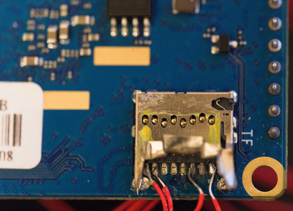
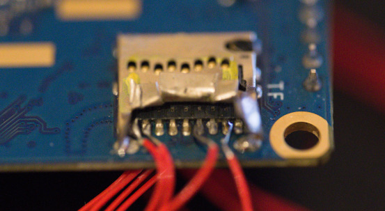

# Obtaining JTAG debug capability on an Orange Pi Zero 3

This article documents the work of [@m0n0cle](https://github.com/m0n0cle) and [@electricworry](https://github.com/electricworry) to obtain JTAG
debugging on an Orange Pi Zero 3 board, a Raspberry Pi like SOC computer
produced by Shenzhen Xunlong Software CO. containing an Allwinner H618 chipset
based on ARM Cortex-A53.

It also serves as a recording of the original tests before the changes were
sent upstream to OpenOCD.

## Running

First build openocd:

```
git submodule update --init --recursive
make
```

Next I tested using an FTDI FT2232H (aka MiniModule?) which has two channels.
I'm using:
* Channel 0: JTAG
* Channel 1: UART


Here Channel 1 GND, BD0 (TX), BD1 (RX) are connected to the board's three pin console and
Channel 0's are connected:

* AD0 (TCK) <-> DAT2
* AD1 (TDI) <-> DAT0
* AD2 (TDO) <-> CMD
* AD3 (TMS) <-> DAT1

```
# With the board powered on
make run-openocd-orange-pi-zero-3
```

## Initial search for a JTAG interface

Initially the hope was that there would be a JTAG interface somewhere on the
board - ideally on some of the 39 pins on the headers, or perhaps there would be
some pads on the board that we could solder onto.

Looking at the Orange Pi documentation about the board, that wasn't something
that they had facilitated on the board's design.

We moved up to looking at the AllWinner specifications, since that would almost
certainly provide JTAG support. The H616 specifications (near identical to the
H618) was easily found online.

Scanning the [datasheet](https://linux-sunxi.org/images/b/b9/H616_Datasheet_V1.0_cleaned.pdf)
for "JTAG" revealed that JTAG pins are available on some of the GPIO pins of the
SoC, but that they are multiplexed with other functions which is common on tiny
SoC designs. Page 27 shows that JTAG is present on pins PF0,1,3,5 (shared with
the SD card) and pins PG6-9 (shared with UART1).

There is also JTAG_SEL pin on the SoC at ball C16 which ostensibly is "used to
select the port from which JTAG function outputs". However, looking at the
[schematic](https://drive.google.com/file/d/1GelRJz-6Dg4i_EQ1SwrfHeqfLOPw9kdO/view)
of the board from Xunlong, C16 is not connected to anything.


We now know that the JTAG functionality might be available in two places:

* SD card - and we know where that is as there's an SD card slot on the board
* UART1 - which could be anything

Looking at the same schematic, we cand see UART1 (PG6-9) are connected to
"BT-UART", which connects to pins 41-44 of the WIFI+BT module.


Thus JTAG availability can be revised:

* SD card - and we know where that is as there's an SD card slot on the board
* WIFI+BT chip

## Enabling JTAG

Before connecting to these locations, we need to change the selected function
on those pins.

[The manual](https://linux-sunxi.org/images/2/24/H616_User_Manual_V1.0_cleaned.pdf)
shows that each GPIO pin, e.g. PF5, can have its function changed by modifying
bits in a configuration register. PF5 is controlled by bits 22-20 of the 32-bit
register at address 0x0300B0B4.


Thankfully out of the box the Orange Pi Zero 3 contains an image on its 16MB
SPI flash chip which includes U-Boot, which we can interact with over the
debug TTL UART pins (which are clearly advertised).

```
[09:20:16.009] tio v2.7
[09:20:16.009] Press ctrl-t q to quit
[09:20:16.019] Connected
[53]HELLO! BOOT0 is starting!
[56]BOOT0 commit : 3ae35eb
[59]set pll start
[61]periph0 has been enabled
[64]set pll end
[67]unknow PMU
[69]unknow PMU
[73]PMU: AXP1530
[77]dram return write ok
[80]board init ok
[81]DRAM BOOT DRIVE INFO: V0.651
[85]the chip id is 0x2000
[87]chip id check OK
[98]DRAM_VCC set to 1100 mv
[100]DRAM CLK =792 MHZ
[103]DRAM Type =8 (3:DDR3,4:DDR4,7:LPDDR3,8:LPDDR4)
[114]Actual DRAM SIZE =2048 M
[117]DRAM SIZE =2048 MBytes, para1 = 30fa, para2 = 8001000, dram_tpr13 = 2006c61
[130]DRAM simple test OK.
[133]rtc standby flag is 0x0, super standby flag is 0x0
[138]dram size =2048
[141]Use rtc to store dram tuning para
[146]spinor id is: 5e 40 18, read cmd: 0b
[150]Succeed in reading toc file head.
[154]The size of toc is 9c000.
[312]Entry_name        = u-boot
[317]Entry_name        = monitor
[321]Entry_name        = dtb
[325]Jump to second Boot.
NOTICE:  BL3-1: v1.0(debug):05d6c57
NOTICE:  BL3-1: Built : 13:35:35, 2021-10-28
NOTICE:  BL3-1 commit: 8
NOTICE:  cpuidle init version V2.0
ERROR:   Error initializing runtime service tspd_fast
NOTICE:  BL3-1: Preparing for EL3 exit to normal world
NOTICE:  BL3-1: Next image address = 0x4a000000
NOTICE:  BL3-1: Next image spsr = 0x1d3

U-Boot 2018.05 (Jul 10 2023 - 10:32:18 +0800) Allwinner Technology

[00.403]CPU:   Allwinner Family
[00.406]Model: sun50iw9
I2C:   ready
[00.410]DRAM:  2 GiB
[00.414]Relocation Offset is: 75f5d000
[00.434]secure enable bit: 0
[00.436]pmu_axp152_probe pmic_bus_read fail
[00.440]PMU: AXP1530
[00.446]CPU=1008 MHz,PLL6=600 Mhz,AHB=200 Mhz, APB1=100Mhz  MBus=400Mhz
[00.452]gic: sec monitor mode
[00.457]flash init start
[00.459]workmode = 0,storage type = 3
SF: Detected zb25vq128as with page size 256 Bytes, erase size 64 KiB, total 16 MiB
[00.476]sunxi flash init ok
[00.480]Loading Environment from SUNXI_FLASH... OK
[00.510]get secure storage map err
[00.513]sunxi secure storage is not supported
[00.517]usb burn from boot
delay time 0
weak:otg_phy_config
[00.530]usb prepare ok
[00.927]usb sof ok
[00.929]usb probe ok
[00.931]usb setup ok
set address 0x12
set address 0x12 ok
[03.937]do_burn_from_boot usb : have no handshake
[03.941]get secure storage map err
[03.944]secure storage init fail
[03.949]update dts
[03.953]update part info
[03.957]update bootcmd
[03.959]No ethernet found.
Hit any key to stop autoboot:  0 
=> 
```

To investigate the current values of the control registers, we can use `md`. We
are primarily interested in PF Configure Register 0 (which controls PF0-6),
PG Configure Register 0 and 1 (which control PG0-15):

```
=> md.l 0x0300B0B4 1
0300b0b4: 07373733
=> md.l 0x0300B0D8 1
0300b0d8: 77777777
=> md.l 0x0300B0DC 1
0300b0dc: 77777777
```

This is interesting. PG0-15 are all set to IO Disable, but PF0-6 are set
different:

* PF6_SELECT: IO Disable
* PF5_SELECT: JTAG_CK
* PF4_SELECT: IO Disable
* PF3_SELECT: JTAG_DO
* PF2_SELECT: IO Disable
* PF1_SELECT: JTAG_DI
* PF0_SELECT: JTAF_MS

This means that when run out of the box with no SD card (with a valid image)
inserted, then the basic firmware present on the SPI flash is enabling JTAG on
the pins used for the SD card already. No writing to control registers is
required.

We decided to test this immediately. 

## Testing JTAG

The schematic shows that the microSD card slot is wired as follows:


We want to connect as follows:

* AD0 (TCK) <-> DAT2
* AD1 (TDI) <-> DAT0
* AD2 (TDO) <-> CMD
* AD3 (TMS) <-> DAT1


Without a suitable microSD breakout available at the time, this happened:




Messy but we're not really concerned with Layer 1.

Initially we didn't have a configuration script for the H618 so we started with
the following:

```
transport select jtag
```

Which produced in OpenOCD:

```
Open On-Chip Debugger 0.12.0+dev-01008-g4fe57a0c1 (2025-05-29-12:53)
Licensed under GNU GPL v2
For bug reports, read
        http://openocd.org/doc/doxygen/bugs.html
Info : Listening on port 6666 for tcl connections
Info : Listening on port 4444 for telnet connections
Warn : An adapter speed is not selected in the init scripts. OpenOCD will try to run the adapter at very low speed (100 kHz).
Warn : To remove this warnings and achieve reasonable communication speed with the target, set "adapter speed" or "jtag_rclk" in the init scripts.
Info : clock speed 100 kHz
Warn : There are no enabled taps.  AUTO PROBING MIGHT NOT WORK!!
Info : JTAG tap: auto0.tap tap/device found: 0x5ba00477 (mfg: 0x23b (ARM Ltd), part: 0xba00, ver: 0x5)
Warn : AUTO auto0.tap - use "jtag newtap auto0 tap -irlen 4 -expected-id 0x5ba00477"
Warn : gdb services need one or more targets defined
```

So far so good, something "ARM Ltd" is being seen.

## Figuring out OpenOCD configuration

At this point we didn't know much about configuring OpenOCD or even much about
JTAG. We got (I think) very lucky here.

First we took an existing configuration for a similar board, Raspberry Pi 4B,
since that's based on a similar ARM processor. That config looked like
[this](doc/bcm2711.cfg) and produced [this](doc/bcm2711_output.txt). Far from
perfect, but connecting to the telnet interface allowed some querying.

```
> dap info
AP # 0x0
                AP ID register 0x64770001
                Type is MEM-AP AHB3
MEM-AP BASE 0xffffffff
                No ROM table present
```

Not great. But with an index of 1 added (`dap info 1`) we got out what we
belive is the CoreSight ROM table. The whole output is [saved](doc/dap_info_1.txt)
but the relevant parts are the Debug Units and the Cross Triggers for each core:

```
	[L02] ROMTABLE[0x0] = 0x00010003
		Component base address 0x81410000
		Peripheral ID 0x04004bbd03
		Designer is 0x23b, ARM Ltd
		Part is 0xd03, Cortex-A53 Debug (Debug Unit)
		Component class is 0x9, CoreSight component
		Type is 0x15, Debug Logic, Processor
		Dev Arch is 0x47706a15, ARM Ltd "Processor debug architecture (v8.0-A)" rev.0
	[L02] ROMTABLE[0x4] = 0x00020003
		Component base address 0x81420000
		Peripheral ID 0x04004bb9a8
		Designer is 0x23b, ARM Ltd
		Part is 0x9a8, Cortex-A53 CTI (Cross Trigger)
		Component class is 0x9, CoreSight component
		Type is 0x14, Debug Control, Trigger Matrix
		Dev Arch is 0x47701a14, ARM Ltd "Cross Trigger Interface (CTI) architecture" rev.0
```

With the information we have we just need to correct the following:

* Correctly name the chip h618
* Set the _DAP_TAPID to 0x5ba00477
* Replace AP num 0 everywhere with 1
* Replace _DBGBASE and _CTIBASE with the values retrieved from the ROM table

That complete [H618 configuration](config/target/allwinner_h618.cfg) has now
been [submitted upstream](https://review.openocd.org/c/openocd/+/8936).

## Proving that JTAG works

```
$ make run-openocd-orange-pi-zero-3 
build/src/openocd -f config/interface/ft2232h.cfg -f config/board/orange_pi_zero_3.cfg
Open On-Chip Debugger 0.12.0+dev-01008-g4fe57a0c1 (2025-05-29-12:53)
Licensed under GNU GPL v2
For bug reports, read
        http://openocd.org/doc/doxygen/bugs.html
Warn : DEPRECATED: auto-selecting transport "jtag". Use 'transport select jtag' to suppress this message.
none separate
Info : Listening on port 6666 for tcl connections
Info : Listening on port 4444 for telnet connections
Info : clock speed 4000 kHz
Info : JTAG tap: h618.cpu tap/device found: 0x5ba00477 (mfg: 0x23b (ARM Ltd), part: 0xba00, ver: 0x5)
Info : [h618.ap] Examination succeed
Info : h618.cpu0: hardware has 6 breakpoints, 4 watchpoints
Info : [h618.cpu0] Examination succeed
Info : h618.cpu1: hardware has 6 breakpoints, 4 watchpoints
Info : [h618.cpu1] external reset detected
Info : [h618.cpu1] Examination succeed
Info : h618.cpu2: hardware has 6 breakpoints, 4 watchpoints
Info : [h618.cpu2] external reset detected
Info : [h618.cpu2] Examination succeed
Info : h618.cpu3: hardware has 6 breakpoints, 4 watchpoints
Info : [h618.cpu3] external reset detected
Info : [h618.cpu3] Examination succeed
Info : [h618.ap] gdb port disabled
Info : [h618.cpu0] starting gdb server on 3333
Info : Listening on port 3333 for gdb connections
Info : [h618.cpu1] starting gdb server on 3334
Info : Listening on port 3334 for gdb connections
Info : [h618.cpu2] starting gdb server on 3335
Info : Listening on port 3335 for gdb connections
Info : [h618.cpu3] starting gdb server on 3336
Info : Listening on port 3336 for gdb connections
```

In another window we connected to the OpenOCD telnet port and issued a halt and
resume (the halt did cause the console interface to freeze until the resume was
executed).

```
$ telnet localhost 4444
Trying 127.0.0.1...
Connected to localhost.
Escape character is '^]'.
Open On-Chip Debugger
> halt
h618.cpu0 cluster 0 core 0 multi core
target halted in Thumb state due to debug-request, current mode: Supervisor
cpsr: 0xa0000173 pc: 0xbff6b094
MMU: enabled, D-Cache: enabled, I-Cache: enabled
> resume
> 
```

Furthermore one can connect to any of the four cores with GDB:

```
$ gdb-multiarch -q -ex "target remote :3333"
Remote debugging using :3333
warning: No executable has been specified and target does not support
determining executable automatically.  Try using the "file" command.
0xbff7ade6 in ?? ()
(gdb) 

```

## Using a proper breakout board

We're not complete savages, so once the PoC was working we ordered some microSD
breakout boards and wired it up properly.


Beautiful.

## More notes

[Another file](doc/EXTREME.md) contains greater detail that I couldn't bring
myself to edit down as some of it could be useful later.
