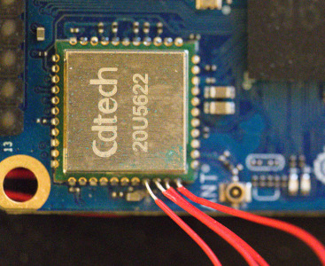

# More notes for the morbidly curious

The journey to getting a good Allwinner H618 configuration wasn't as smooth as
[documented](../README.md). There were many segues that didn't need to be told
and the steps outlined already are the important leaps to get to a working
JTAG configuration on that board.

To avoid knowledge rot, here's everything that happened.

(TODO: Incomplete.)

## Pivoting to Raspberry Pi 3 Model B for testing

* Without JTAG working well on the Orange Pi, we moved over to a board that we
  believed the community had already got working: Raspberry Pi 3 Model B.
* Spent a long time trying to understand the config.
* Also spent a long time *using* OpenOCD in its working state to get a feel for
  what a good configuration feels like.
* Spent a *lot* of time flailing around the ARM documentation trying to
  understand what CoreSight is, the ROM table, etc.
* Made useful discovery that CoreSight memory address space can be queried
  with `x/` in GDB and that those values tallied up with the OpenOCD
  interpretation of the ROM table (as dumped by `dap info 0`). That would be
  expected, but seeing the values pulled from GDB demystified/cemented it.

## Back to Orange Pi Zero 3 for final configuration

Steps taken to obtain a working OpenOCD configuration...

* Messing with the MEM-AP config to read memory.
* Memory looks wrong.
* Discovery of ap-num 1 => memory looks correct, but different.
* Description of the hierarchical ROM table and difference from Raspberry Pi 3B.
  Document with links if possible.
* Getting OpenOCD to dump the ROM table successfully.
* Inserting the ROM table Debug and CTI base addresses to the config.
* Demonstrate working JTAG/GDB debugging

## Switching to the Wifi/BT pins?

Obviously stealing the SD card pins for JTAG debugging limits the usefulness of
the JTAG interface; one can only debug an OS flashed to the SPI memory which is
limited to 16MB, and generally the Orange Pi is intended to be used with a
larger OS via the SD card. One thing we considered doing was to disable the
radio and run JTAG over those pins. That looks like this:



In the end we didn't pursue this further as the benefits of running the OS over
Allwinner FEL mode was discovered, so we don't really need the microSD card to
do testing after all.

## Other commands

```
> h618.cti0 dump
     CTR (0x0000) 0x00000001
    GATE (0x0140) 0x00000000
   INEN0 (0x0020) 0x00000000
   INEN1 (0x0024) 0x00000000
   INEN2 (0x0028) 0x00000000
   INEN3 (0x002c) 0x00000000
   INEN4 (0x0030) 0x00000000
   INEN5 (0x0034) 0x00000000
   INEN6 (0x0038) 0x00000000
   INEN7 (0x003c) 0x00000000
   INEN8 (0x0040) 0x00000000
  OUTEN0 (0x00a0) 0x00000001
  OUTEN1 (0x00a4) 0x00000002
  OUTEN2 (0x00a8) 0x00000000
  OUTEN3 (0x00ac) 0x00000000
  OUTEN4 (0x00b0) 0x00000000
  OUTEN5 (0x00b4) 0x00000000
  OUTEN6 (0x00b8) 0x00000000
  OUTEN7 (0x00bc) 0x00000000
  OUTEN8 (0x00c0) 0x00000000
    TRIN (0x0130) 0x00000000
   TROUT (0x0134) 0x00000001
    CHIN (0x0138) 0x00000000
   CHOUT (0x013c) 0x00000000
  APPSET (0x0014) 0x00000000
  APPCLR (0x0018) 0x00000000
APPPULSE (0x001c) 0x00000000
   INACK (0x0010) 0x00000000
  DEVCTL (0x0150) 0x00000000
```

## Various links

* ROM table: https://developer.arm.com/documentation/ddi0500/j/Debug/ROM-table/ROM-table-register-summary?lang=en
* Useful blog: https://metebalci.com/blog/bare-metal-raspberry-pi-3b-jtag/
* ROM table: https://developer.arm.com/documentation/ddi0316/d/functional-description/rom-table
* Debug memory map: https://developer.arm.com/documentation/ddi0500/j/Debug/External-debug-interface/Debug-memory-map?lang=en#BABJACCH
